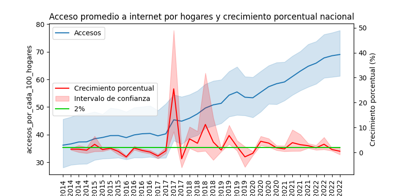

# Proyecto individual 2 - Data Analytics - PT04


<p align="center">
  <a href=""></a>
</p>

## Contexto

En los ultimos tiempos las telecomunicaciones, en particular, el internet ha sido uno de los grandes de sus grandes pilares, permitiendo el intercambio de información de manera tanto nacional como internacional aun en medio de una pandemia. Hoy el uso de internet es prácticamente una deber debido a su amplio uso en el mundo entero.

En la actualidad la Argentina  está a la vanguardia en el desarrollo de las telecomunicaciones, teniendo para el 2020 un total de <a href="https://www.datosmundial.com/america/argentina/telecomunicacion.php">62,12 millones de conexiones</a>.

## Rol a desarrollar

Según el contexto mencionado se me encarga un estudio exahustivo del comportamiento de las telecomunicaciones para una firma de este rubro, en particular, realizar el analisis de los datos relacionados al acceso a internet de la Argentina, con el fin de orientar a la empresa en el mejoramiento de su servicio de internet y poder extender su servicio a nuevos clientes.

## Fuente de datos

La extracción de estos datos se ha hecho desde la API de <a href="https://datosabiertos.enacom.gob.ar/dashboards/20000/acceso-a-internet/">ENACOM</a>

## Objetivos

- Realizar un análisis que determine la situación actual del acceso a internet de la Argentina.

- Evaluar el crecimiento porcentual del acceso a internet en los hogares argentinos.

- Representar de manera gráfica los hallazgos en el comportamiento de las variables estudiadas

- Proponer mejoras servicio para el cliente lo cual se traducirá en ganacias a la compañia.

## EDA (*Exploratory Data Analysis*)

El analisis exploratorio de la data fue llevado a cabo usando:

[](https://skillicons.dev)

Y se llevaron a cabo los siguientes pasos:

- Extracción de los datasets vía API de ENACOM.

```md
'http://api.datosabiertos.enacom.gob.ar/api/v2/datastreams/GUID/data.ajson/?auth_key='+AUTH_KEY
```

siendo el GUID el identificador del dataset.

- Tranformación de los datasets:
  - Normalización
  - Limpieza
  - Revisión de *outliers*
  - Calculos de los KPI

- Representación gráfica usando matplotlib y seaborn.

- Respectivas conclusiones para cada visualización.

Si desea ver este análisis puede hacer click [aquí](#).

## Desarrollo de los KPIS

### Acceso

| Métrica | Valor |
| --- | ----------- |
| Número de habitantes total | 37.484.525 |
| Numero de accesos a internet | 6.305.058 |

<p align="center">
  <a href=""></a>
</p>

Segun nuestro KPI era necesario aumentar el acceso al menos al 2%, esto se cumplió el 38% del tiempo.

### Velocidad

<p align="center">
  <a href=""></a>
</p>

Ahh la wawa

<p align="center">
  <a href=""></a>
</p>