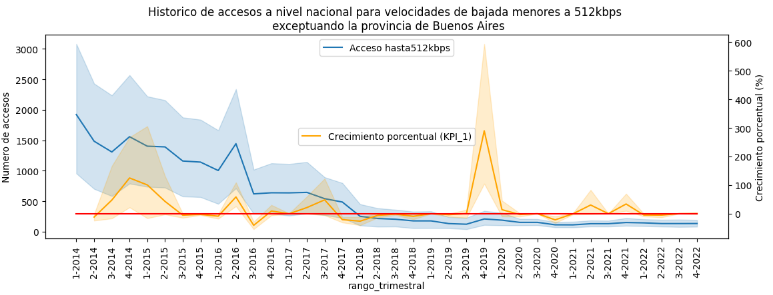

# Proyecto individual 2 - Data Analytics - PT04


<p align="center">
  <a href=""></a>
</p>

## Contexto

En los ultimos tiempos las telecomunicaciones, en particular, el internet ha sido uno de sus grandes pilares, permitiendo el intercambio de información de manera tanto nacional como internacional aun en medio de una pandemia. Hoy el uso de internet es prácticamente un deber debido a su amplio uso en el mundo entero considerando el teletrabajo.

En la actualidad la Argentina  está a la vanguardia en el desarrollo de las telecomunicaciones, teniendo para el 2020 un total de <a href="https://www.datosmundial.com/america/argentina/telecomunicacion.php">62,12 millones de conexiones</a>.

## Rol a desarrollar

Según el contexto mencionado se me encarga un estudio exahustivo del comportamiento de las telecomunicaciones para una firma de este rubro (ArgTeleco), en particular, realizar el analisis de los datos relacionados al acceso a internet de la Argentina, con el fin de orientar a la empresa en el mejoramiento de su servicio de internet y poder extender su servicio a nuevos clientes.

## Fuente de datos

La extracción de estos datos se ha hecho desde la API de <a href="https://datosabiertos.enacom.gob.ar/dashboards/20000/acceso-a-internet/">ENACOM</a>

## Objetivos

- Realizar un análisis que determine la situación actual del acceso a internet de la Argentina.

- Evaluar el crecimiento porcentual del acceso a internet en los hogares argentinos.

- Representar de manera gráfica los hallazgos en el comportamiento de las variables estudiadas

- Proponer mejoras servicio para el cliente lo cual se traducirá en ganacias a la compañia.

## EDA (*Exploratory Data Analysis*)

El analisis exploratorio de la data fue llevado a cabo usando:

[](https://skillicons.dev)

Y se llevaron a cabo los siguientes pasos:

- Extracción de los datasets vía API de ENACOM.

```md
'http://api.datosabiertos.enacom.gob.ar/api/v2/datastreams/GUID/data.ajson/?auth_key='+AUTH_KEY
```

siendo el GUID el identificador del dataset.

- Tranformación de los datasets:
  - Normalización
  - Limpieza
  - Revisión de *outliers*
  - Calculos de los KPI

- Representación gráfica usando matplotlib y seaborn.

- Respectivas conclusiones para cada visualización.

Si desea ver este análisis puede hacer click [aquí](#).

## Desarrollo de los KPIS

### Acceso

| Métrica | Valor |
| --- | ----------- |
| Número de habitantes total | 37.484.525 |
| Numero de accesos a internet | 6.305.058 |

<p align="center">
  <a href=""></a>
</p>

Segun nuestro KPI era necesario aumentar el acceso al menos al 2%, esto se cumplió el 38% del tiempo. Considerando que nuestro KPI era el siguiente:

$$
\mathrm{AxH} = \dfrac{(\mathrm{acceso\_actual} - \mathrm{acceso\_previo})}{\mathrm{acceso\_previo}} \cdot 100
$$

* "Acceso actual" se refiere al número de hogares con acceso a Internet después del próximo trimestre.
* "Acceso previo" se refiere al número de hogares con acceso a Internet en el trimestre actual.

### Velocidad

Una de las metas empresariales planteadas es aumentar el acceso a internet de alta velocidad en al menos un 50%, es decir, un acceso del 50% para velocidades mayores a 30Mbps y esto lo medimos con la siguiente expresión

$$
\mathrm{HSI} = \dfrac{\mathrm{acceso_{+30mbps}}}{\mathrm{acceso\_total}} \cdot 100
$$

Donde:

* "$\mathrm{acceso_{+30mbps}}$" es el numero de accesos para velocidades mayores a 30Mbps.

* "$\mathrm{acceso_{total}}$" el acceso total para todos los rangos de velocidad.

En los últimos tiempo un acceso a internet mas alto satisface los requerimientos actuales de productos que exhibe el internet, un ejemplo de ello son los videos de alta resolución, ello produce una demanda de internet de alta velocidad para una navegación satisfactoria en la red.

<p align="center">
  <a href=""></a>
</p>

El historico nacional sin involucrar a la provincia de Buenos Aires demuestra que las actualización a velocidades de internet más altas son ampliamente aceptadas por la población quedando relegadas las de baja velocidad.

<p align="center">
  <a href=""></a>
</p>

<p align="center">
  <a href=""></a>
</p>

El crecimiento de accesos a internet mayor a los 30mbps tiene algunos picos de crecimiento para los años 2017, 2018 y 2019, reduciendose el crecimiento en ese ambito para los proximos años.

### Alcance de las tecnologías de acceso a internet

Es importante conocer que provincias o también localidades del país representan una oportunidad de negocio.

<p align="center">
  <a href=""></a>
</p>

Segun el análisis gráfico realizado las provincias de Catamarca y Mendoza representan una oportunidad de inversión que pudiese retribuir los esfuerzos.

| Provincia | Oportunidad |
| --- | ----------- |
| Catamarca | Invertir en internet satelital (15000 habitantes sin acceso a internet) |
| Mendoza | Invertir en internet movil (+200.000 habitantes sin acceso a internet movil4G y 3G) |

### Tecnologías

En el último trimestre de de 2022 los accesos a internet de repatieron de la siguiente manera

<p align="center">
  <a href=""></a>
</p>

Siendo apreciable que la fibra óptica representa la segunda mejor tecnología a nivel de acceso en la nación, esto debido a sus ventajas detalladas [aquí](https://www.hp.com/cl-es/shop/tech-takes/diez-ventajas-de-tener-conexion-a-internet-por-fibra-optica) y además de tener un costo mas accesible, siendo uno de los grandes retos la puesta en marcha para la distribución de los cables de fibra optica en el país.

Con todo ello, sus capacidades rebasan los contras y es recomendado seguir invirtiendo en esta tecnología, conforme a los retos en la demanda de velocidades mas altas en el futuro.


## Stack tecnológico

* Tranformación de datos: python | pandas
* Visualización: matplotlob | seaborn

## Conclusiones

* El crecimiento en el sector de las telecomunicaciones, en particular, el acceso a internet a mejorado a partir del año 2017.

* Se pudo medir el crecimiento porcentual de accesos a internet por hogares, el cual obtuvo un crecimiento importante a partir de año 2017, y aumentando en al menos 2% el 38% del tiempo analizado en este estudio.

* Se realizaron gráficas correspondientes que permiten visualizar de una manera eficiente los cambios en la variables a estudiar

* Se recomienda invertir en el sector de inter movil 4G y 3G en la provincia de Mendoza

* Se recomienda invertir en internet satelital para cubrir el nulo acceso a las tecnologías de acceso a internet en la provincia de Catamarca

* En la actualidad se ha alcanzado la meta propuesta de disponibilizar para la mayoría de accesos a internet un velocidad de al menos 30Mbps, lograndose este hecho en el ultimo trimestre del año 2021
